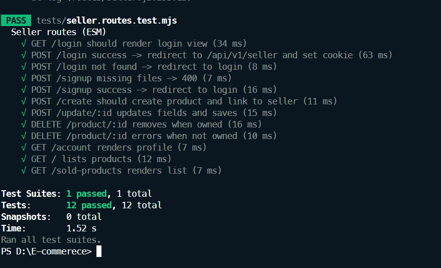

# README.md
# Testing Overview for Seller Routes

This document provides an overview of the testing strategy for the seller routes in our application. We use Jest as our testing framework to ensure that our seller routes function as expected.

## Testing Strategy

Our testing strategy includes unit tests and integration tests for the seller routes. Each test case is designed to cover various scenarios, including successful requests, error handling, and edge cases.

## Running the Tests

To run the tests for the seller routes, follow these steps:

1. Ensure you have Node.js and npm installed on your machine.
2. Install the necessary dependencies by running:
   ```
   npm install
   ```
3. Execute the tests using Jest by running:
   ```
   npm test
   ```

This will run all test files in the `tests` directory, including `seller.routes.test.js`.

